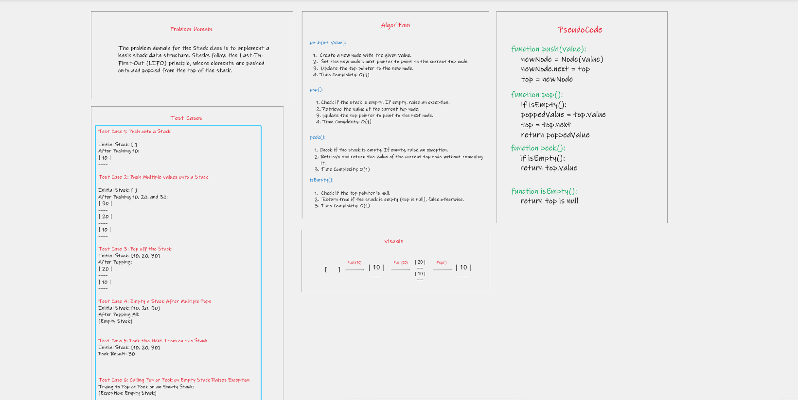
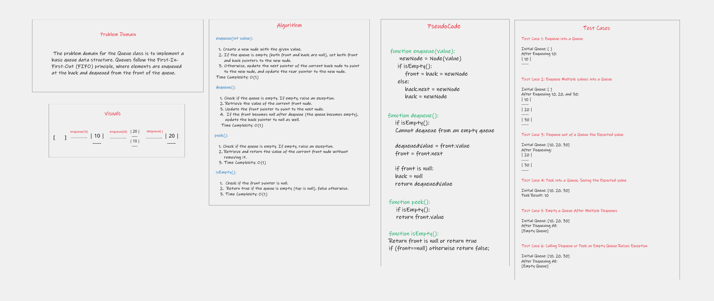
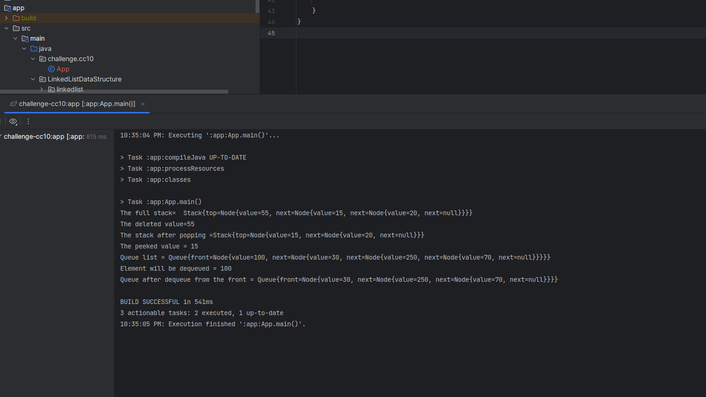

# Stack and Queue Classes 

## Stack Class

The `Stack` class is an implementation of a basic stack data structure in Java. It includes the following methods:

### Whiteboard process of Stack

### `push(int value)`

- **Description:** Adds a new node with the given value to the top of the stack.
- **Parameters:** `value` - The value to be added to the stack.
- **Time Complexity:** O(1)

### `pop()`

- **Description:** Removes and returns the value from the top of the stack.
- **Returns:** The value from the node at the top of the stack.
- **Time Complexity:** O(1)
- **Exception:** Raises an `IllegalStateException` if called on an empty stack.

### `peek()`

- **Description:** Returns the value of the node located at the top of the stack without removing it.
- **Returns:** The value of the node at the top of the stack.
- **Time Complexity:** O(1)
- **Exception:** Raises an `IllegalStateException` if called on an empty stack.

### `isEmpty()`

- **Description:** Checks if the stack is empty.
- **Returns:** `true` if the stack is empty, `false` otherwise.
- **Time Complexity:** O(1)

## Queue Class

The `Queue` class is an implementation of a basic queue data structure in Java. It includes the following methods:

### Whiteboard process of Stack

### `enqueue(int value)`

- **Description:** Adds a new node with the given value to the back of the queue.
- **Parameters:** `value` - The value to be added to the queue.
- **Time Complexity:** O(1)

### `dequeue()`

- **Description:** Removes and returns the value from the front of the queue.
- **Returns:** The value from the node at the front of the queue.
- **Time Complexity:** O(1)
- **Exception:** Raises an `IllegalStateException` if called on an empty queue.

### `peek()`

- **Description:** Returns the value of the node located at the front of the queue without removing it.
- **Returns:** The value of the node at the front of the queue.
- **Time Complexity:** O(1)
- **Exception:** Raises an `IllegalStateException` if called on an empty queue.

### `isEmpty()`

- **Description:** Checks if the queue is empty.
- **Returns:** `true` if the queue is empty, `false` otherwise.
- **Time Complexity:** O(1)

---
## Approach & Efficiency 

### **Stack**

Approach:

    A Stack follows the Last-In-First-Out (LIFO) principle, meaning the most recently added element is the first one
    to be removed. Stacks are typically implemented using a singly linked list or an array.

Efficiency:

    All stack operations (push, pop, peek, isEmpty) have a constant time complexity of O(1) in most implementations.
    The space complexity of a stack depends on the implementation, but it is typically O(n), where n is the number of 
    elements in the stack.

### **Queue**

Approach:

    A Queue follows the First-In-First-Out (FIFO) principle, meaning the first element added is the first one to be
    removed. Queues are typically implemented using a singly linked list or an array.

Efficiency:

    Enqueue and dequeue operations have a constant time complexity of O(1) in most implementations.
    The peek operation also has a constant time complexity of O(1).
    The space complexity of a queue depends on the implementation, but it is typically O(n), where n is the number of 
    elements in the queue. 

## Solution

  - javac App.java
  - java App

These implementations provide a basic understanding of how to use Stack and Queue data structures in Java. 
Creating instances of these classes and utilize the methods to perform stack and queue operations in created 
applications.

