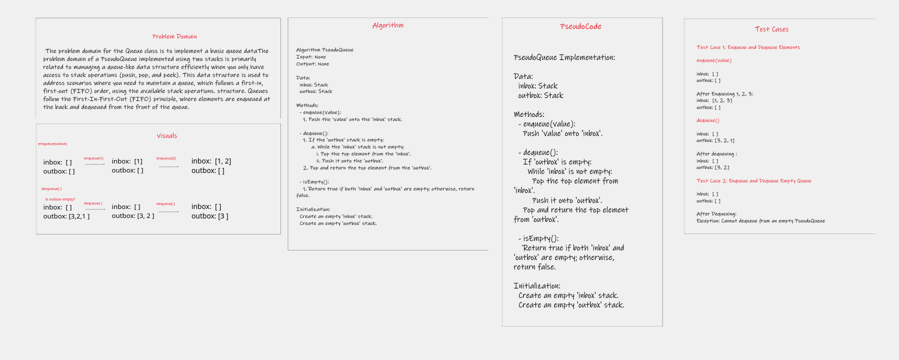
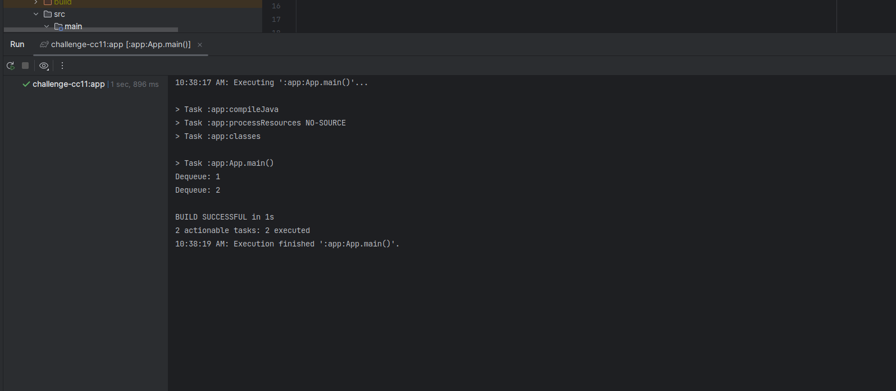

# PseudoQueue Using Stacks

This is a Java implementation of a PseudoQueue data structure using two stacks.A PseudoQueue is a data structure that 
implements a queue using two stacks. It allows you to perform enqueue and dequeue operations efficiently, maintaining 
a first-in, first-out (FIFO) order.

## Features

- Enqueue values into the PseudoQueue.
- Dequeue values from the PseudoQueue in a FIFO manner.
- Supports generic data types for flexibility.

## White-Board process

## Approach & Efficiency

**Approach** 

    Enqueue Operation:
        When enqueuing an element, you push it onto one of the stacks, let's say inbox. This operation has a time 
        complexity of O(1) since it involves only a single push operation on the stack.

    Dequeue Operation:
        When dequeuing an element, you first check if the outbox is empty. If it is, you transfer all elements from
        the inbox to the outbox, effectively reversing their order. This transfer operation takes O(N), where N is the
        number of elements in the inbox. Once elements are in the outbox, you perform a pop operation on the outbox,
        which is O(1).

**Efficiency**
    time complexity for both enqueue and dequeue operations can be considered O(1). This means that over a sequence of 
    operations, the average time remains constant.
    space complexity is O(N), where N is the total number of elements in the PseudoQueue.

## Solution 

