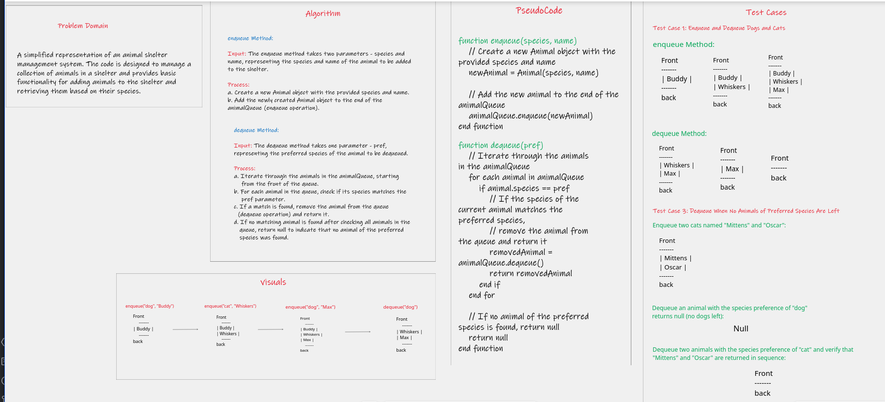

# Animal Shelter Queue

This Java program implements an Animal Shelter that holds dogs and cats and operates on a first-in, first-out basis. 
It provides the following functionality:

- `enqueue`: Adds an animal (either a dog or a cat) to the shelter.
- `dequeue`: Removes and returns an animal based on preference (either "dog" or "cat").

## Usage

1. Create an instance of the `AnimalShelter` class.
2. Use the `enqueue` method to add animals to the shelter, specifying their species ("dog" or "cat") and name.
3. Use the `dequeue` method to retrieve an animal based on preference ("dog" or "cat").

## WhiteBoard 

## Solution 
