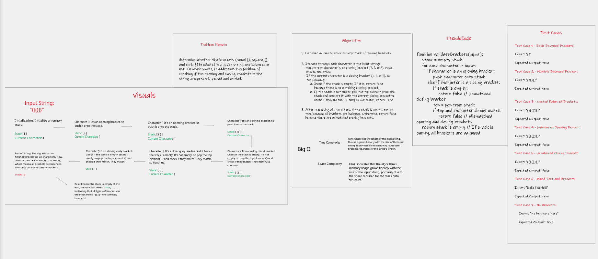
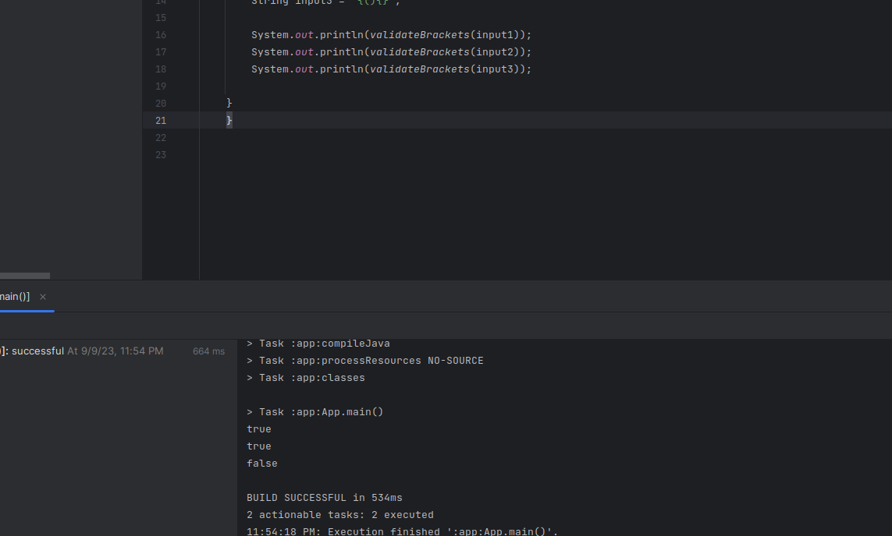

# Bracket Validator
The BracketValidator class is a Java utility for checking whether the brackets in a given string are balanced. 
It supports three types of brackets: round brackets (), square brackets [], and curly brackets {}.

## Approach & Efficiency

The BracketValidator class employs a stack-based approach to determine if brackets within a given string are balanced.
It iterates through each character in the input, pushing opening brackets onto a stack and verifying the matching of 
closing brackets with the stack's top element. If a mismatch is detected or if a closing bracket appears without a 
preceding opening bracket, the function returns false. After processing all characters, if the stack is empty, 
indicating balanced brackets, the function returns true.

- Time Complexity: O(n), where n is the length of the input string. Runtime grows linearly with the size of the input 
                   string. It provides an efficient way to validate brackets regardless of the string's length.

- Space Complexity: O(n),  indicates that the algorithm's memory usage grows linearly with the size of the input string,
                    primarily due to the space required for the stack data structure.

## WhiteBoard

## Solution
