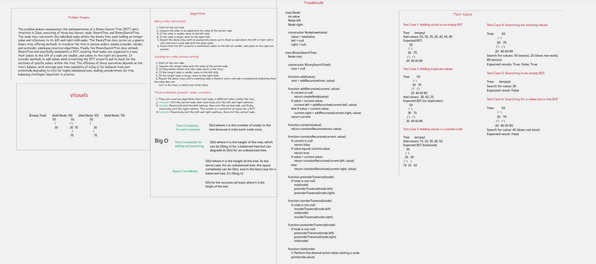
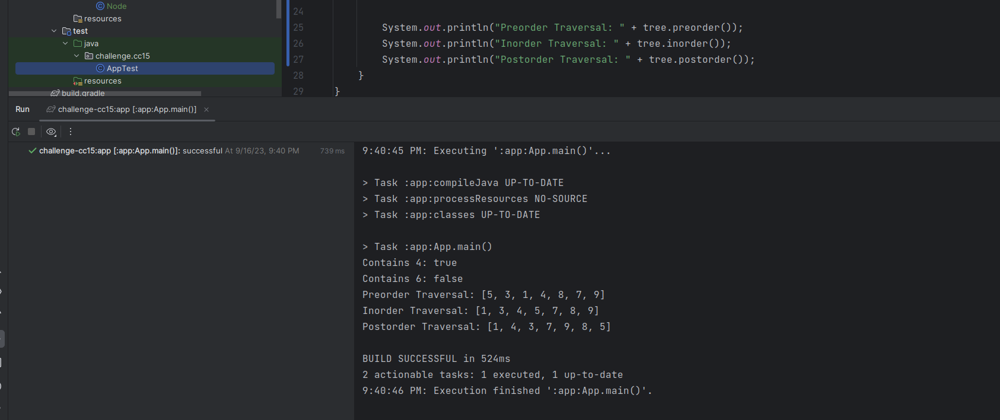

# Binary Tree and BST Implementation

## Approach & Efficiency

- BinaryTree class:

  **Approach:**
  It contains a root node reference as its member variable.
  The preorder(), inorder(), and postorder() methods use recursive traversal to collect the values of nodes in the 
  respective orders. These methods initialize an empty list, pass it to a helper function, and fill it with the values obtained during traversal.
  
  **Efficiency:**
  - Time Complexity for each traversal: O(n) where n is the number of nodes in the tree because it visits each node once.
  - Space Complexity: O(h) where h is the height of the tree. In the worst case, for an unbalanced tree, the space 
    complexity can be O(n), and in the best case for a balanced tree, it's O(log n).

- BinarySearchTree class:

  **Approach:**
  It inherits the root variable from BinaryTree.
  The add(int value) method adds a new node with the given value to the BST while maintaining the BST property. 
  It uses a recursive approach to traverse the tree and insert the new node in the correct position.
  The contains(int value) method checks if a value exists in the BST by recursively searching the tree for the value.
  **Efficiency:**
  - Time Complexity for adding and searching: O(h) where h is the height of the tree, which can be O(log n) for 
    a balanced tree but can degrade to O(n) for an unbalanced tree.
  - Space Complexity: O(h) for the recursive call stack, where h is the height of the tree.

## WhiteBoard

## Solution
