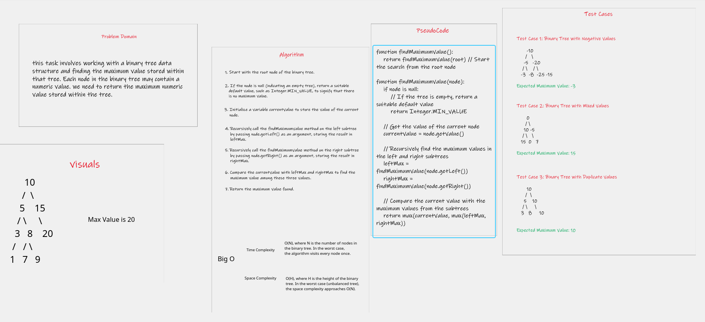
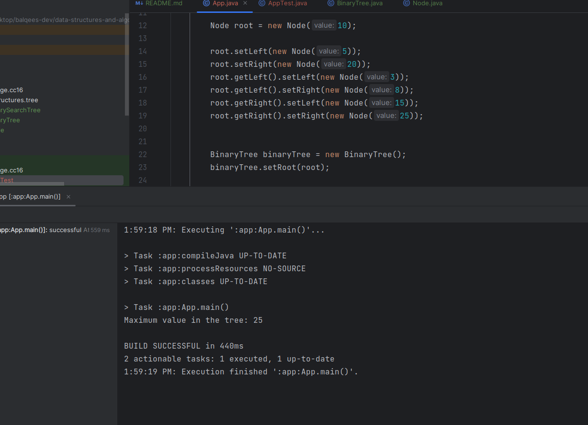

# Binary Tree and BST Implementation

## Approach & Efficiency
  **Approach:**

  The findMaximumValue method utilizes a recursive depth-first search (DFS) approach to traverse the binary tree.
  It starts from the root node and explores each branch of the tree until it reaches the leaves. At each node, 
  it compares the current value with the maximum values found in the left and right subtrees, ensuring that the
  maximum value is propagated up the tree.

  **Efficiency:**
  - Time Complexity:O(N), where N is the number of nodes in the binary tree. In the worst case, 
      the algorithm visits every node once.
  - Space Complexity:  O(H), where H is the height of the binary tree. In the worst case (unbalanced tree), 
    the space complexity approaches O(N).

## WhiteBoard

## Solution
