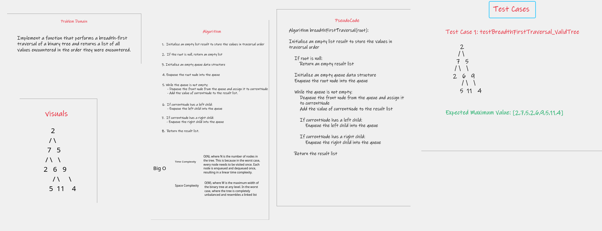
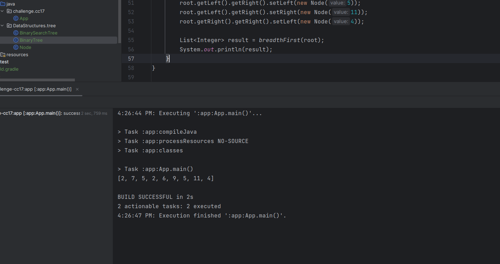

## tree-breadth-first

Implement a function that performs a breadth-first traversal of a binary tree and returns a list of all values
encountered in the order they were encountered.

## Approach & Efficiency

**Approach**

1. Start with the root node and initialize an empty queue to store nodes for traversal and an empty list (result) to
   store the values encountered in traversal.
2. Enqueue the root node into the queue.
3. While the queue is not empty:
      - Dequeue the front node from the queue (FIFO).
      - Add the value of the dequeued node to the result list.
      - Enqueue any existing left and right child nodes of the dequeued node if they are not null.

4. Continue this process until the queue is empty.

5. Return the result list containing the values encountered during the traversal.

**Efficiency**
- Time Complexity: is O(N), where N is the number of nodes in the tree. This is because in the worst case, every node 
  needs to be visited once. Each node is enqueued and dequeued once, resulting in a linear time complexity. 

- Space Complexity: is O(W), where W is the maximum width of the binary tree at any level. In the worst case, where 
  the tree is completely unbalanced and resembles a linked list, the space complexity would be O(N), but in 
  well-balanced binary trees, the space complexity is generally much lower.

## WhiteBoard

## Solution

