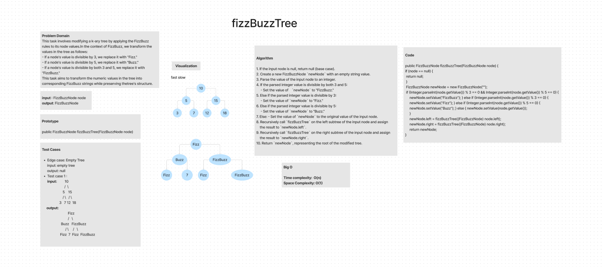
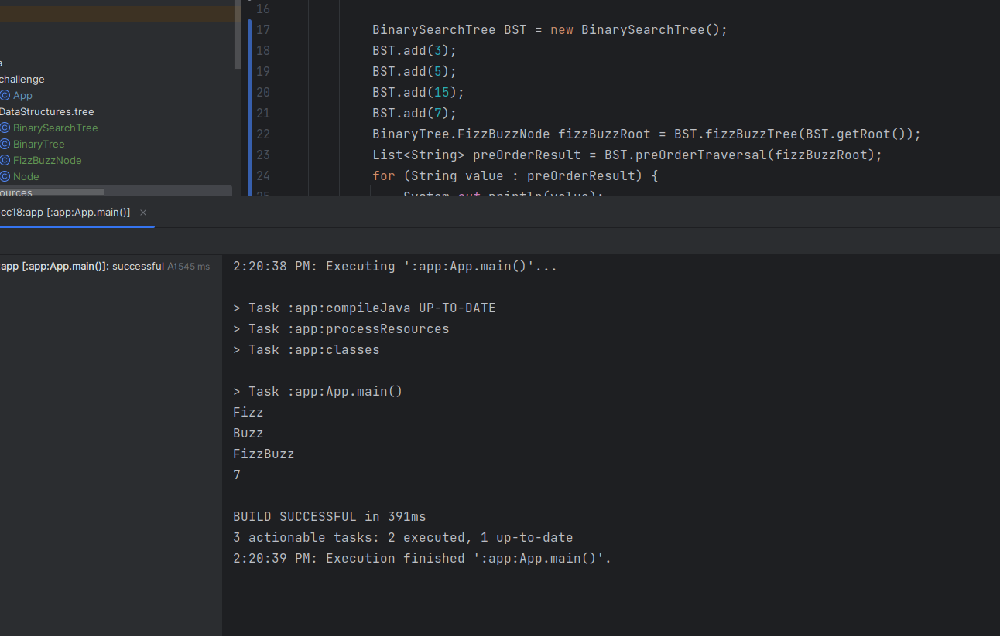

# Tree-fizz-Buzz

The "FizzBuzz Tree" task involves modifying a k-ary tree by applying the FizzBuzz rules to its node values.
In the context of FizzBuzz, we transform the values in the tree as follows:

- If a node's value is divisible by 3, we replace it with "Fizz."
- If a node's value is divisible by 5, we replace it with "Buzz."
- If a node's value is divisible by both 3 and 5, we replace it with "FizzBuzz."

This task aims to transform the numeric values in the tree into corresponding FizzBuzz strings while preserving the
tree's structure.

## WhiteBoard

## Approach & Efficiency 

- **Approach** 
#### Tree Traversal

the approach to solving the FizzBuzz Tree task involves recursive tree traversal. Started at the root of the tree
and traverse the entire tree structure, processing each node along the way.

1. **Recursive Depth-First Traversal**: We use a recursive depth-first traversal to visit each node in the tree. 
   This allows us to explore all branches of the tree efficiently.

2. **FizzBuzz Transformation**: For each node, we check its value to determine whether it is divisible by 3, 5, or both.
   Based on the divisibility, update the node's value with "Fizz," "Buzz," or "FizzBuzz" as appropriate.

3. **Recursion for Children**: After processing a node, we recursively apply the FizzBuzz transformation to its 
   children, ensuring that the entire tree is processed.

- **Efficiency**

  **Time Complexity**: O(N), where N is the total number of nodes in the tree. since it visits each node once during 
  the tree traversal, and the FizzBuzz transformation is done in constant time.

  **Space Complexity**: O(N) due to the recursion stack. In the worst case, the recursion stack can reach a 
  depth equal to the height of the tree, which is O(N) for an unbalanced tree.

## Solution 

