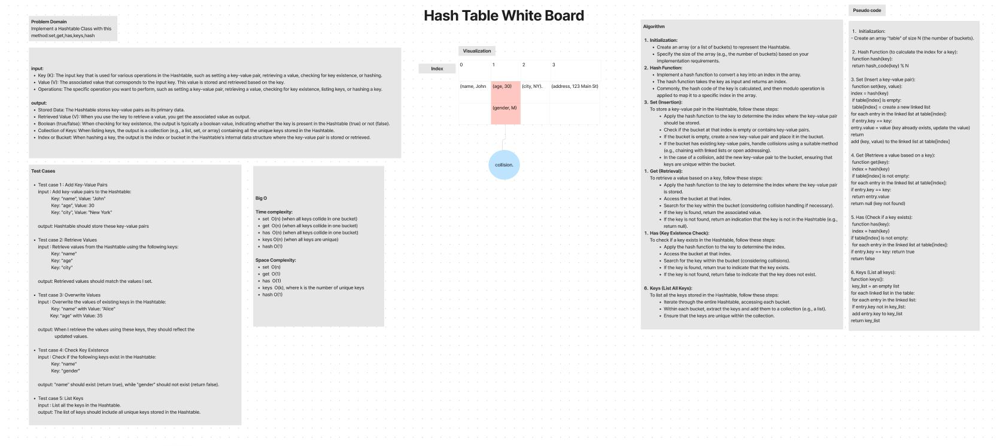
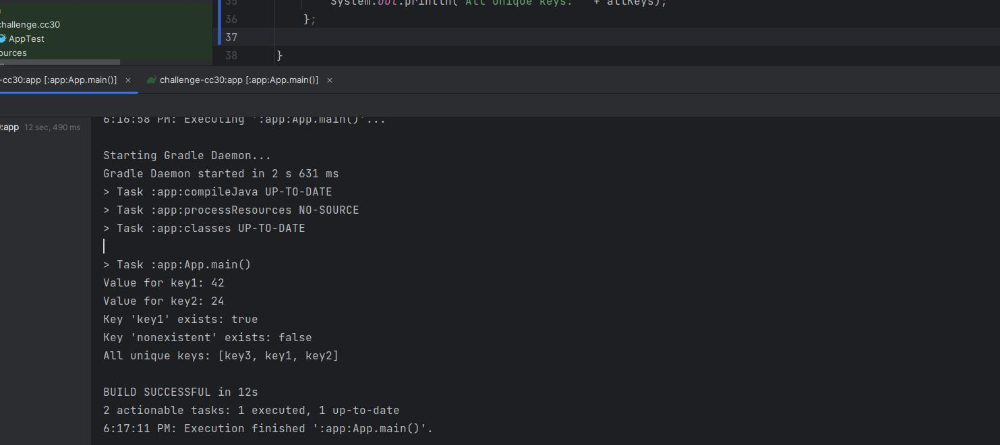

# Implementation of a HashMap in Java.

This implementation provides basic functionality for storing key-value pairs in a hash table. 
It includes the following features:

- **Setting a Key/Value Pair**: Setting a key and its corresponding value in the hash map using the 
  `set(K key, V value)` method.

- **Retrieving Values by Key**: Retrieving the value associated with a key using the `get(K key)` method.

- **Checking for Key Existence**: Checking if a key exists in the hash map using the `has(K key)` method, which returns
  `true` if the key is found and `false` otherwise.

- **Listing Unique Keys**: The `keys()` method returns a list of all unique keys stored in the hash map.

- **Handling Collisions**: This implementation handles collisions by chaining, which means multiple key-value pairs
  with the same hash code are stored in a linked list within the same bucket.

- **Hashing Keys to an In-Range Value**: The `hash(K key)` method calculates the hash code of a key and maps it to a 
  value within the range [0, size - 1], where `size` is the initial capacity of the hash map.

----------------------------------------------------
## Whiteboard Process

-----------------------------------------------------

## Approach & Efficiency

**set(K key, V value)**

  - Approach: Calculate the hash code, locate the bucket, and iterate through the linked list to update or add a key-value pair.
  - Efficiency:
        Average time complexity: O(1)
        Worst-case time complexity: O(n) (when all keys collide in one bucket)
        Space complexity: O(n)

**get(K key)**
  - Approach: Calculate the hash code, locate the bucket, and iterate through the linked list to find and return the value.
  - Efficiency:
        Average time complexity: O(1)
        Worst-case time complexity: O(n) (when all keys collide in one bucket)
        Space complexity: O(1)

**has(K key)**

  - Approach: Similar to get, checks for the existence of a key.
  - Efficiency:
        Average time complexity: O(1)
        Worst-case time complexity: O(n) (when all keys collide in one bucket)
        Space complexity: O(1)

**keys()**

 - Approach: Iterate through all buckets and linked lists to collect unique keys into a list.
 - Efficiency:
        Time complexity: O(n) in the worst case (when all keys are unique).
        Space complexity: O(k), where k is the number of unique keys.

**hash(K key)**

 - Approach: Calculate the hash code for a key and map it to an in-range value.
 - Efficiency:
        Time complexity: O(1)
        Space complexity: O(1)
-------------------------------------------------------

## Solution

