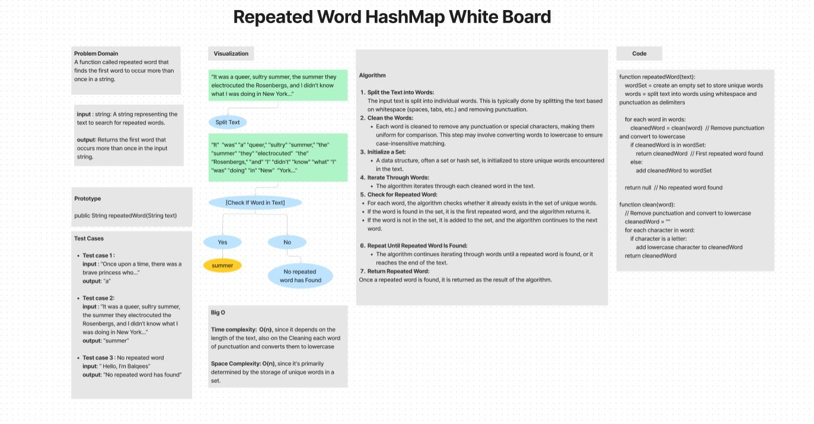
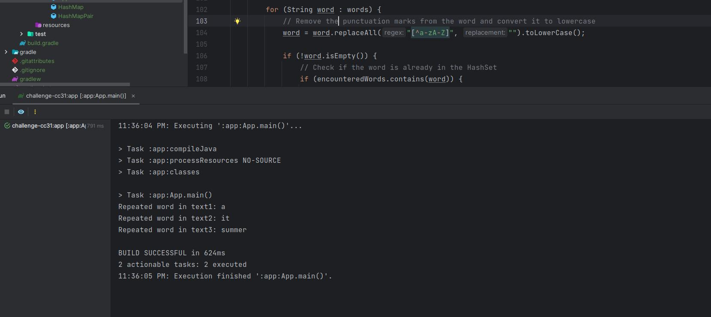

# Hashmap-repeated-word

A function called repeated word that finds the first word to occur more than once in a string.

## Whiteboard Process

## Approach & Efficiency

The repeatedWord function employs an approach that efficiently uses a HashMap to keep track of word frequencies while
iterating through the input string. It splits the string into words, cleans them of punctuation and converts them to
lowercase to ensure case-insensitive comparison. As it encounters words,it checks if they are already in the HashMap,
making it easy to identify the first repeated word. 

- **Time complexity:** is O(n),where n is the number of words in the input string, since it depends on the length of the 
  text, also on the Cleaning each word of punctuation and converts them to lowercase. 
- **Space complexity:** is O(w), where 'w' is the number of unique words, since it's primarily determined by the 
  storage of unique words in a set.

## Solution

After compiling, run the Java program using the java command followed by the class name, and it will execute the main 
function that invokes the RepeatedWord class.

