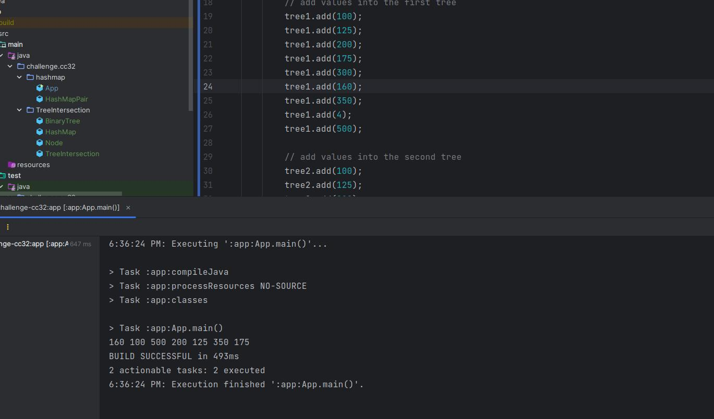

# tree-intersection

A function called tree_intersection that finds common values in two binary trees.

## Whiteboard Process

## Approach & Efficiency

The time and space complexities for finding common values (intersection) between two binary trees in the 
tree_intersection method are determined by how many unique values are present in the two binary trees and how they are
organized within the trees.

- **Time complexity:** is O(min(n1, n2)), number of common values cannot exceed the number of values in the smaller set.
  This ensures that the complexity doesn't exceed O(min(n1, n2)) even when all values are common.

- **Space complexity:** is O(max(n1, n2)), because it's determined by the larger of the two sets 
  (values of Tree1) or (values ofTree2), since it cannot exceed the size of the smaller set.

## Solution

