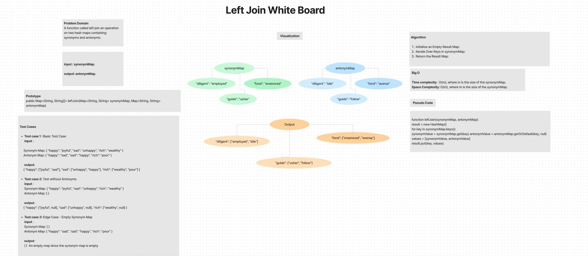
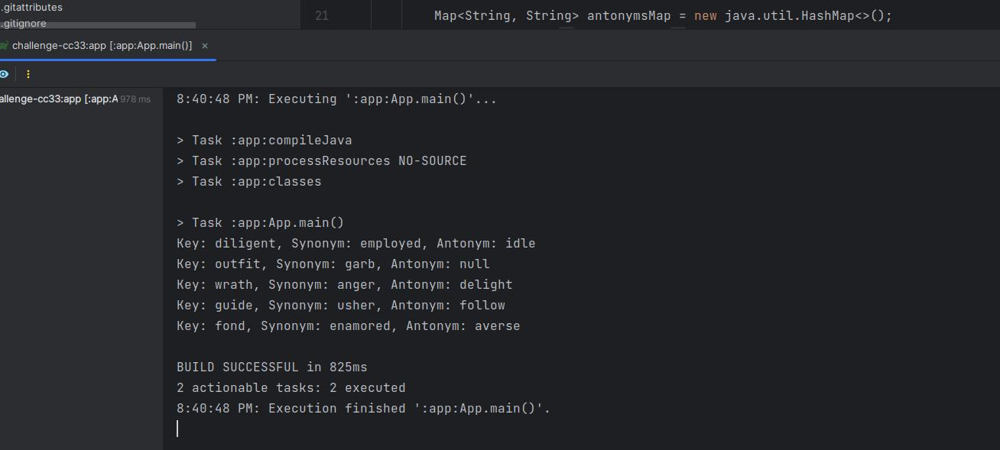

# tree-intersection

This Java class implements a basic HashMap with additional functionality for a left join operation on two hash maps 
containing synonyms and antonyms.
## Whiteboard Process

## Approach & Efficiency
The leftJoin method is designed to perform a left join operation on two hash maps (synonymMap and antonymMap). 
Here's the approach and efficiency analysis for the leftJoin method:

- **Time complexity:** is O(m), where m is the size of the synonymMap.

- **Space complexity:** is O(m), where m is the size of the synonymMap.
- 
## Solution

