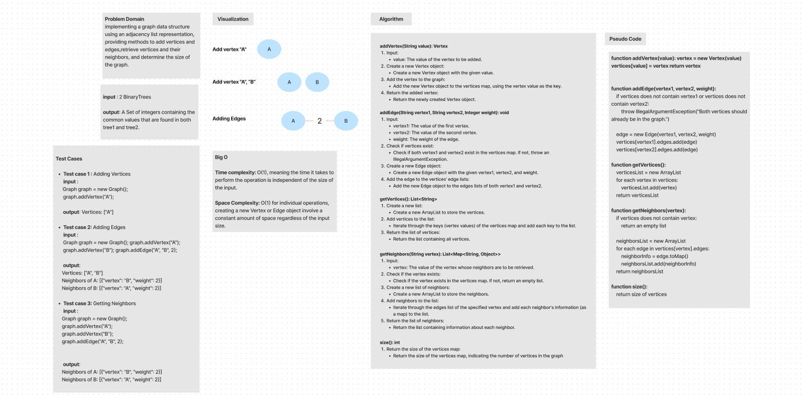
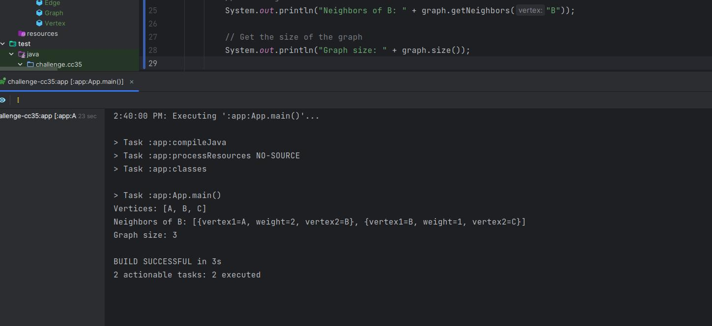

# Implementation: Graphs

implementing a graph data structure using an adjacency list representation, providing methods to add vertices and edges,
retrieve vertices and their neighbors, and determine the size of the graph.

## Whiteboard Process

## Approach & Efficiency

- **Time complexity:** 
   1. Most individual operations are O(1), meaning the time it takes to perform the operation is independent of the 
      size of the input.
   2. The time complexity of methods involving iteration over edges or vertices is O(E) or O(V), 
      where E is the number of edges, and V is the number of vertices, since operations that involve iterating over 
      vertices or edges have time complexity proportional to the number of vertices (V) or edges (E). For example,
      in the getVertices method, creating a list of vertices takes O(V) time

- **Space complexity:** 
   1. The space complexity is generally O(1) for individual operations, creating a new Vertex or Edge object involve a 
      constant amount of space regardless of the input size.
   2. The space complexity of methods involving creating lists of vertices or edges is O(V) or O(E).

## Solution

