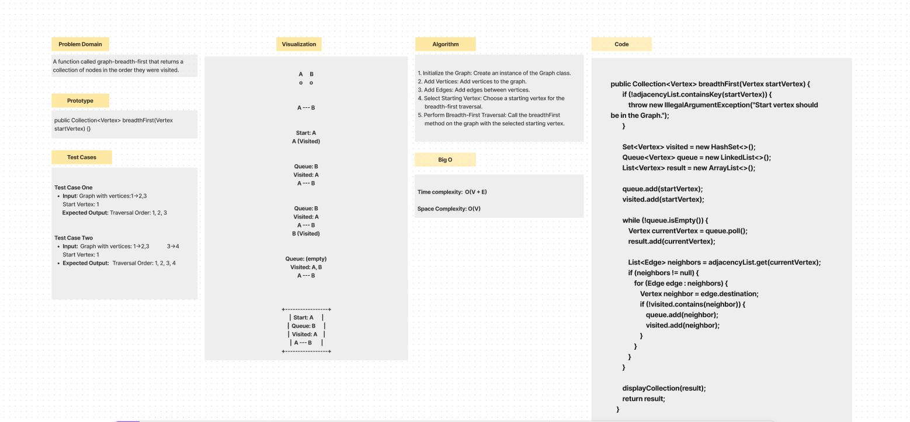
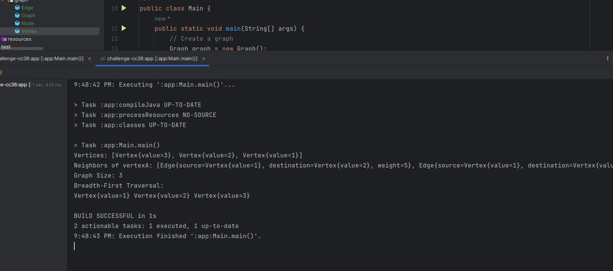

# breadth-first traversal on a graph.

A function called graph-breadth-first that returns a collection of nodes in the order they were visited.

## Whiteboard Process

## Approach & Efficiency

The approach for the provided Java code implementing breadth-first search in a graph involves utilizing a queue and a 
set to traverse the graph starting from a specified vertex. The algorithm begins by enqueueing the initial vertex,
marking it as visited, and iteratively dequeue vertices, printing them, and enqueueing their unvisited neighbors until 
the queue is empty. 

- **Time complexity:** is O(V + E), where V is the number of vertices and E is the number
  of edges, as each vertex and edge is visited once.

- **Space complexity:** is O(V) due to the storage of visited vertices in a set and the queue, making it a practical 
  solution for exploring graphs.

## Solution

