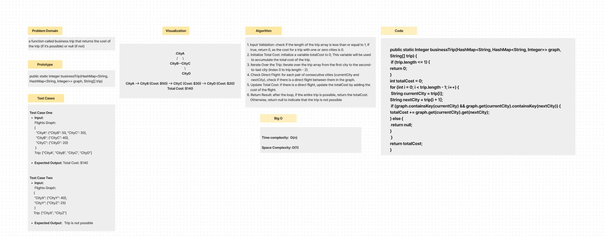
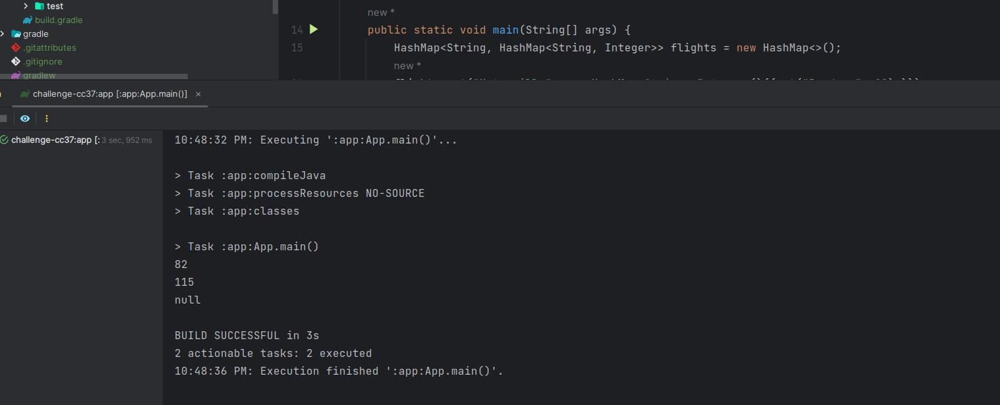

# graph-business-trip

a function called business trip that returns the cost of the trip (if it’s possible) or null (if not)

## Whiteboard Process

## Approach & Efficiency

- **Time complexity:** is O(n), where n is the length of the trip array, as it iterates through each city in the trip.

- **Space complexity:** is O(1) as the function uses a constant amount of space regardless of the input size

## Solution

