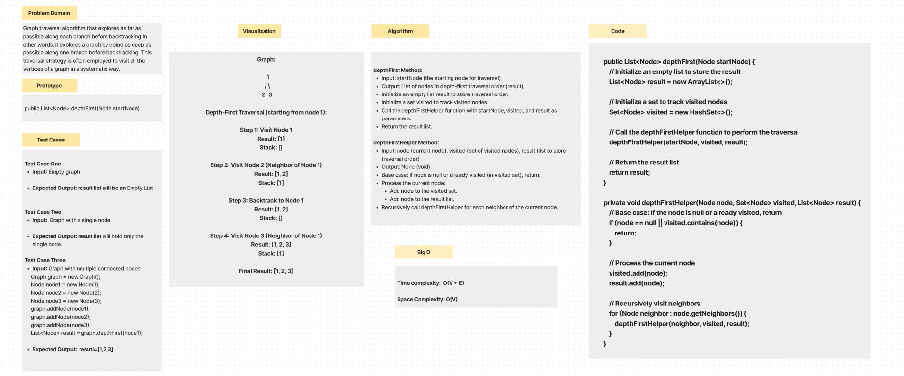
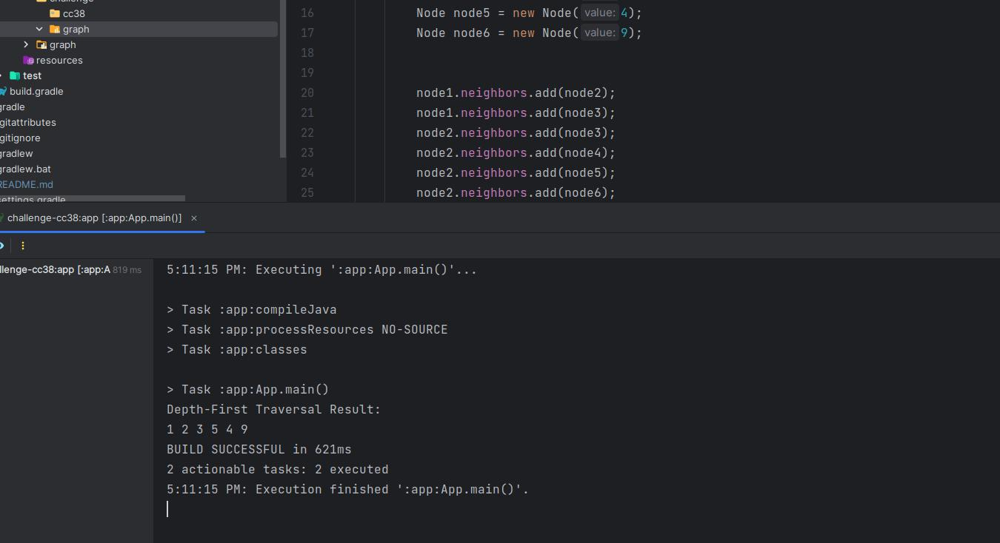

# graph-depth-first
Graph traversal algorithm that explores as far as possible along each branch before backtracking.
In other words, it explores a graph by going as deep as possible along one branch before backtracking. 
This traversal strategy is often employed to visit all the vertices of a graph in a systematic way.

## Whiteboard Process

## Approach & Efficiency
For the Depth-First Traversal implementation in a graph, I utilized a recursive approach.
The algorithm uses a set to keep track of visited nodes, ensuring that each node is processed only once.

- **Time complexity:** is O(V + E), where V is the number of vertices (nodes) and E is the number of edges in the graph.
  This is because each vertex and edge is visited once.

- **Space complexity:** is O(V), where V is the number of vertices. 
  This is due to the space required for the recursive call stack and the set to track visited nodes.

## Solution

