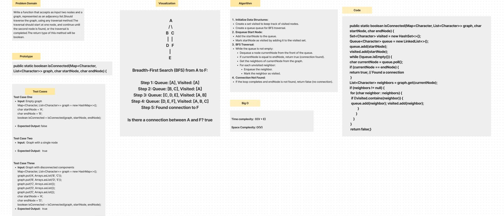
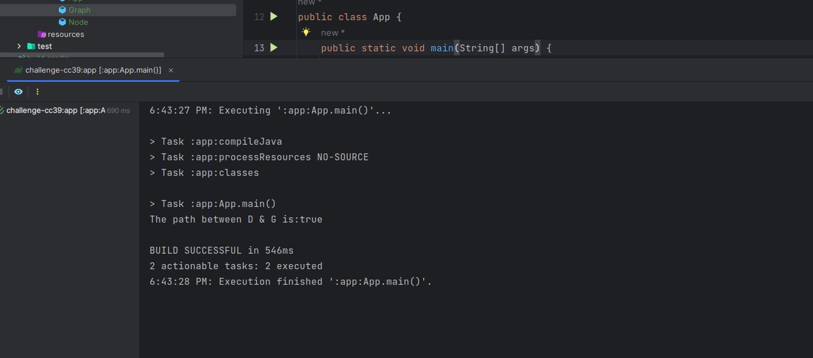

# isConnected
Write a function that accepts as input two nodes and a graph, represented as an adjacency list.
Should traverse the graph, using any traversal method.
The traversal should start at one node, and continue until the second node is found, or the traversal is completed.
The return type of this method will be boolean.

## Whiteboard Process

## Approach & Efficiency

- **Time complexity:** is O(V+E), where V is the number of vertices (nodes) and E is the number of edges in the graph. 

- **Space complexity:** is O(V), where V is the number of vertices (nodes) in the graph.

## Solution

