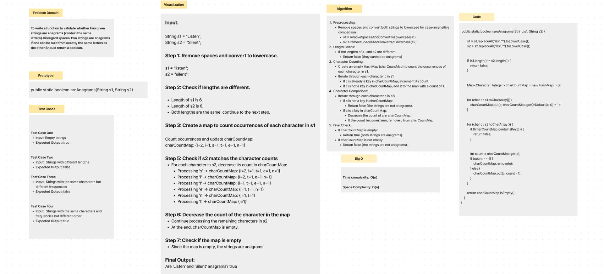
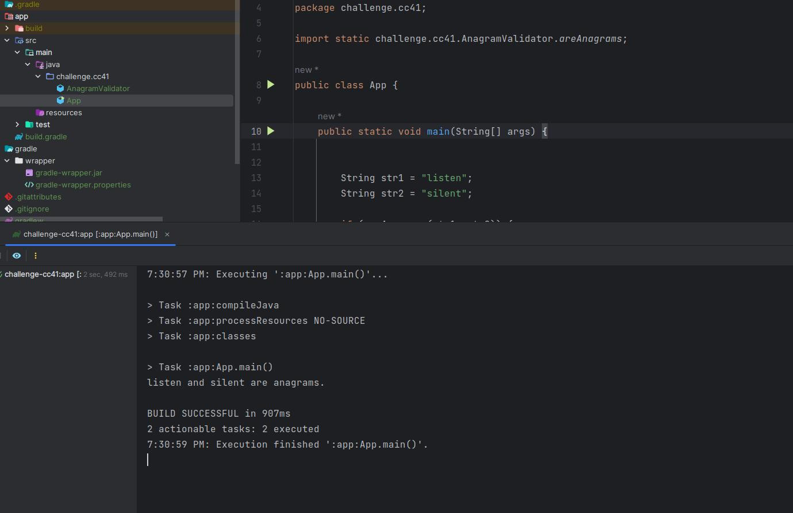

# 
To write a function to validate whether two given strings are anagrams (contain the same letters).
Disregard spaces.
Two strings are anagrams if one can be built from exactly the same letters as the other.
Should return a boolean. 

## Whiteboard Process

## Approach & Efficiency

- **Time complexity:** is O(n), The first for-loop iterates through each character in the first string (s1).
  The second for-loop iterates through each character in the second string (s2).
  Additionally, the map operations inside the loops involve constant time operations.

- **Space complexity:** is O(n), s influenced by the space required for the character count map (charCountMap). In the
   worst case, where all characters are unique, the map would have a size proportional to the length of the string (n).

## Solution

