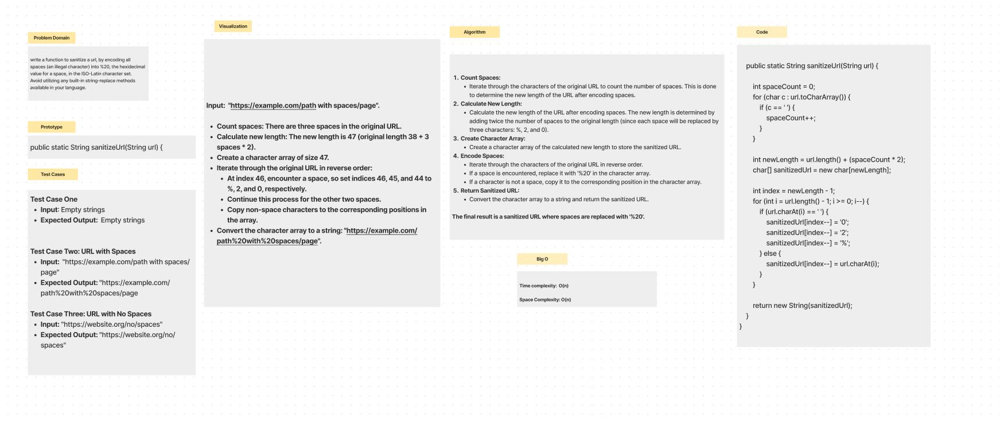
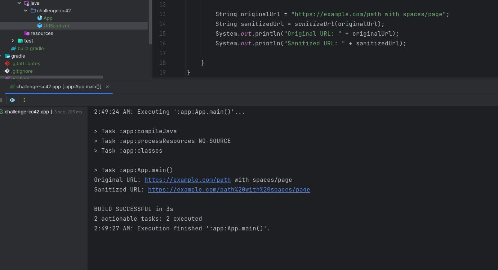

# Sanitize URL
Write a function to sanitize a url, by encoding all spaces (an illegal character) into %20, the hexidecimal value for a
space, in the ISO-Latin character set.
Avoid utilizing any built-in string-replace methods available in your language.

## Whiteboard Process

## Approach & Efficiency

- **Time complexity:** O(n), where n is the length of the original URL. The function iterates through the original URL
  to count spaces and then performs a single pass to create the sanitized URL.

- **Space complexity:** O(n), as the function uses a character array of size newLength to store the sanitized URL. The 
  additional space is proportional to the number of spaces in the original URL.
## Solution

