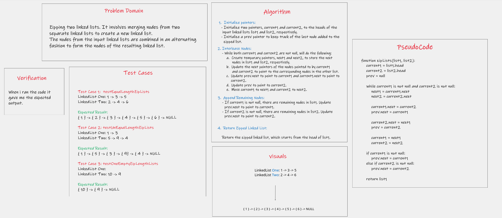

# Code Challenge / Algorithm
This code challenge asked to Zip two linked lists. It involves merging nodes from two separate linked lists to create 
a new linked list. The nodes from the input linked lists are combined in an alternating fashion to form the nodes of 
the resulting linked list. 

## Whiteboard Process

## Approach & Efficiency
- Approach
 
  1. Traverse the Two Input Lists:
  Start by initializing two pointers, current1 and current2, to the heads of the two input linked lists.
  These pointers will be used to traverse the input lists.

  2. Interleave Nodes:
  While both current1 and current2 are not null, repeatedly perform the following steps:

     a. Create temporary pointers, next1 and next2, to store the next nodes in list1 and list2, respectively.
     b. Update the next pointers of the nodes pointed to by current1 and current2 to point to the corresponding nodes 
        in the other list. This interleaves the nodes.
     c. Move current1 to next1 and current2 to next2.

  3. Append Remaining Nodes:
     After the interleaving is complete, there might be remaining nodes in one of the lists (if the lists are of 
     different lengths). If list1 has more nodes, simply append the remaining nodes of list1 to the end of the 
     zipped list. If list2 has more nodes, append the remaining nodes of list2 to the zipped list.

  4. Return Zipped Linked List.

- Efficiency
  zips the two linked lists in a way that respects the relative order of nodes within each input list, while 
  maintaining O(1) space complexity. I tested this approach with various test cases to ensure it works
  correctly and handles different scenarios, such as linked lists of different lengths or one list being empty.

#### **Big O Analysis**

- **Time complexity:** O(n), where n is the total number of nodes in both input linked lists. This is because 
  traversing each node once to interleave them and possibly appending remaining nodes.

- **Space complexity:** O(1) because I'm not creating any new nodes; you're only using a constant amount of 
  additional memory for temporary variables.

## Solution

1. cd challenge-cc8.
2. Go to the App.java.
3. Run App.

