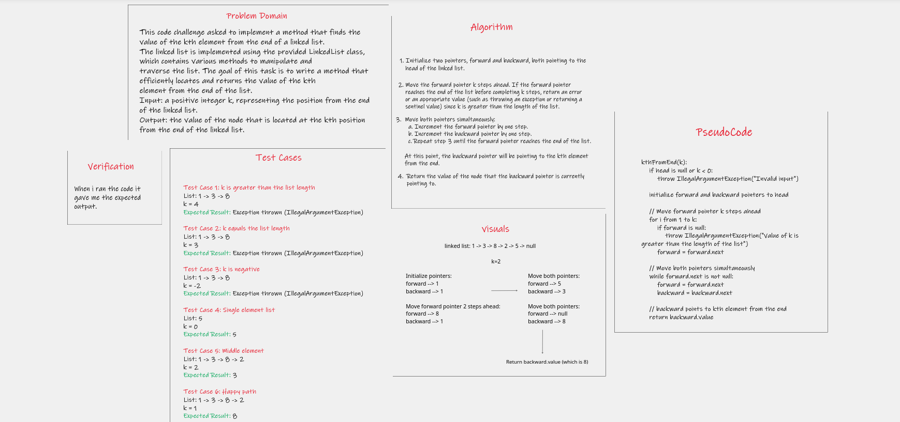
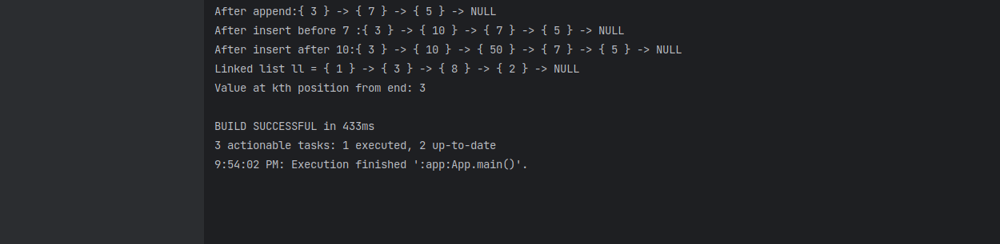

# Implementation: Extending an Implementation
This code challenge asked to implement a method that finds the value of the kth element from the end of a linked list.
The linked list is implemented using the provided LinkedList class, which contains various methods to manipulate and
traverse the list. The goal of this task is to write a method that efficiently locates and returns the value of the kth 
element from the end of the list.
Input: a positive integer k, representing the position from the end of the linked list.
Output: the value of the node that is located at the kth position from the end of the linked list.

## Whiteboard Process

## Approach & Efficiency
- Approach
  To find the kth element from the end of a linked list, utilize a two-pointer strategy. Initialize two pointers,
  forward and backward, both pointing to the head of the list. Move the forward pointer k nodes ahead to create a gap 
  of k nodes between the two pointers. Then, traverse the list by advancing both pointers simultaneously until the 
  forward pointer reaches the end. This ensures that the backward pointer is positioned at the kth node from the end,
  allowing easy retrieval of its value.

- Efficiency
  The two-pointer approach offers a time-efficient solution, requiring only a single pass through the list. The 
  algorithm runs in O(n) time complexity, where n represents the number of nodes in the linked list. By utilizing 
  this approach, the algorithm efficiently solves the problem without the need for multiple traversals. 
 

#### **Big O Analysis**

**ll.kthFromEnd(k)**

- **Time complexity:** O(n + k) because The reason for this is that we move the forward pointer k steps ahead and then
  move both pointers simultaneously until the forward pointer reaches the end. In the worst case, the forward pointer
  may need to traverse the entire list, resulting in a total of n + k steps.

- **Space complexity:** is O(1) due to the constant amount of extra space required for the two pointers.

## Solution

1. cd java-challenges-cc6.
2. Go to the App.java.
3. Run App.

