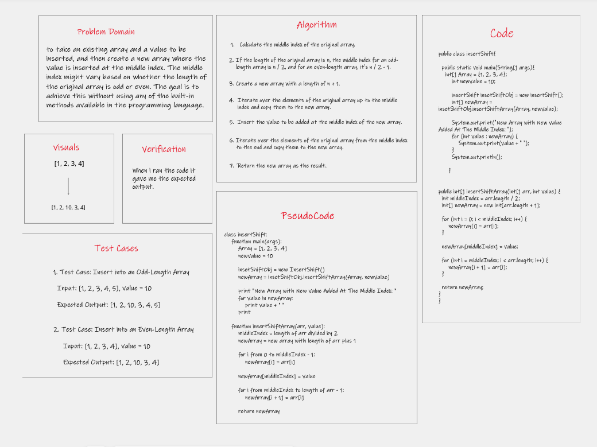
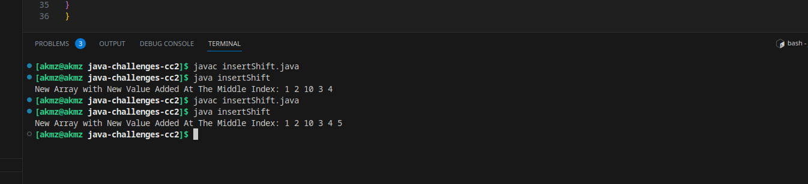

# Array Reverse

 This coding challenge involves creating a "whiteboard only" solution
 to r takes in an array and a value to be added, where is required to write a function named
 insertShiftArray that takes an array as input and returns an array with the new value added
 at the middle index.

## Whiteboard Process



## Approach & Efficiency

```
The insertShiftArray function takes an array and a value to insert. It puts the value in the middle of the array, keeping all the other values intact. It does this by making a new slightly bigger array,putting the value in the right spot, and copying the old values around it. This process is efficient 
and works well for arrays of different sizes.

```

## Big O Analysis

- **time complexity:** of O(n), where n is the length of the input array. This is because the function
    goes through the array twice: once to copy elements before the middle index and once to copy elements
    after the middle index.

- **space complexity:** of the function is also O(n). This is because it creates a new array with a length
    one more than the original array to accommodate the  inserted value.

## Solution

   1. cd java-challenges-cc2.
   2. javac insertShift.java .
   3. java insertShift.
   

   
