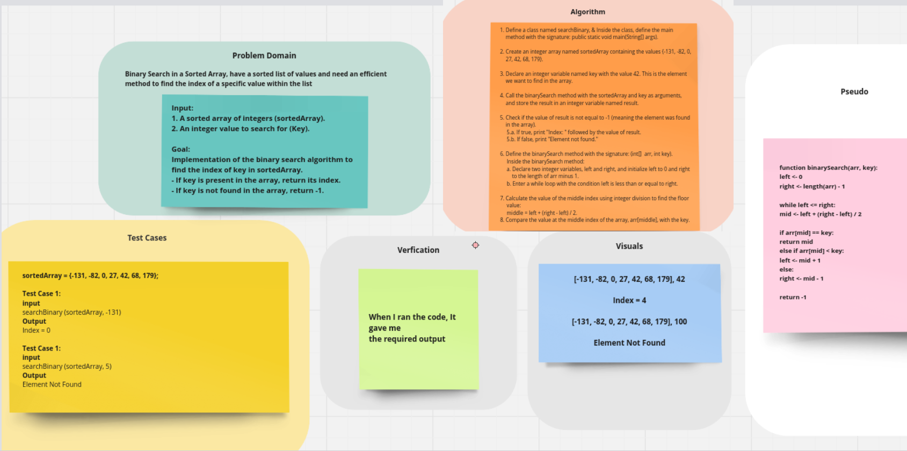

# Binary Search
This coding challenge involves creating a "whiteboard only" solution.
I wrote a function called BinarySearch which takes in 2 parameters: a sorted array and the search key and return the the index of the array’s element that is equal to the value of the search key, or -1 if the element is not in the array.


## Whiteboard Process



## Approach & Efficiency

```
The binarySearch function follows a straightforward approach where it iterates through each 
element of the sorted array and checks if the current element matches the search key. If a match 
is found, the index of the element is returned. If no match is found after iterating through the
entire array, the function returns -1 to indicate that the key is not found in the array. The 
efficiency of the linear search algorithm depends on the size of the array and the position of 
the key within the array.

```

#### Big O Analysis

- **time complexity:** 
O(log n) due to the division of search space in each iteration.

- **space complexity:** 
O(1) due to minimal extra space usage.


## Solution

   1. cd java-challenges-cc3.
   2. javac searchBinary.java .
   3. java searchBinary. 
   

   
