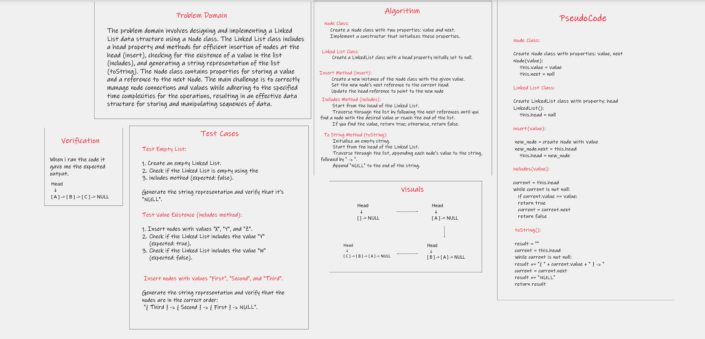

# Implementation: Singly Linked Lists
In this challenge, I'm working on creating and implementing linked lists. I constructed a Node class
that holds value properties and a pointer to the next Node. Developed a LinkedList class with a head 
property, ensuring that an empty linked list is initialized upon instantiation. Within the linked list 
class, I created methods for inserting nodes at the head with O(1) time complexity, checking for the existence
of a value, and generating a formatted string representation of the linked list.

## Whiteboard Process

## Approach & Efficiency

**Node Class Approach & Efficiency:**

    The Node class is designed to hold a value and a reference to the next node.
    It's a simple building block used within data structures like linked lists.
    The class encapsulates the core properties needed for linked structures.
    Accessing the value or the reference to the next node takes constant time (O(1)).
    Creating a new node is also constant time (O(1)).

**Linked List Approach & Efficiency:**

    A linked list is built using nodes that are linked together.
    Each node holds a value and a reference to the next node in the sequence.
    The head property points to the first node, and the last node's reference is typically null.
    Insertion at the head is very efficient, taking constant time (O(1)).
    Insertion at a specific position requires traversing, resulting in O(n) time.
    Searching for a value has an average efficiency of O(n), linear time.
    Appending or removing the last element can be inefficient without tail reference, requiring O(n) traversal.
    Linked lists are memory-efficient, as they dynamically allocate memory for each node.

#### **Big O Analysis**
**Node Class:**

    - Time Complexity:
        Creating a new Node instance: O(1)
        Accessing the value of a Node: O(1)
        Accessing the reference to the next Node: O(1)
    - Space Complexity:
        Memory required for a Node instance: O(1)

    Since it involves allocating memory for the node and initializing its properties. Since the number of operations 
    performed is constant regardless of the size of the data, the time complexity is O(1).

**LinkedList Class:**

    - Time Complexity:
        Insertion at the head (using insert): O(1) Since it involves updating references.
        Searching for a value (using includes): O(n) on average (linear time) due to linear traversal, where n is the number of nodes.
        String conversion (using toString): O(n) on average (linear time)
    - Space Complexity:
        Memory usage for a LinkedList instance: O(n) due to the memory required for nodes

## Solution

   1. cd java-challenges-cc5.
   2. javac App.java .
   3. java App. 

