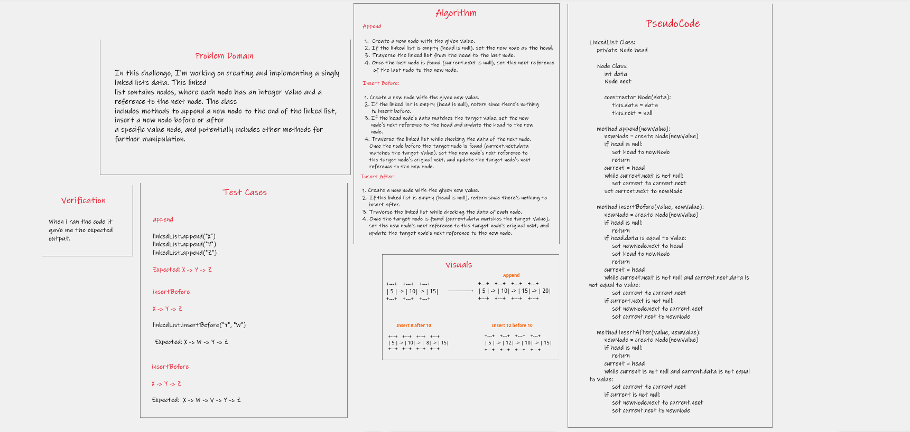
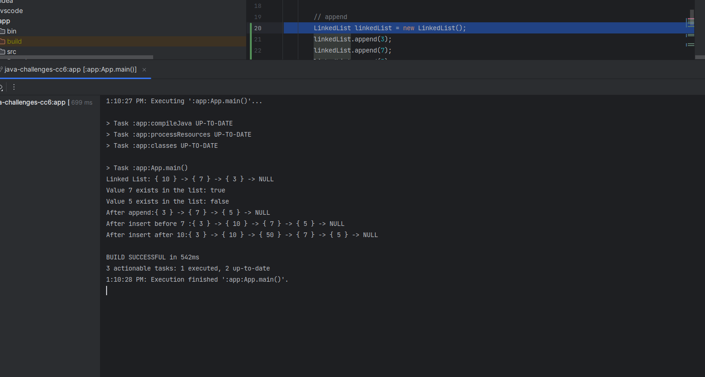

# Implementation: Extending an Implementation
In this challenge, I'm working on creating and implementing a singly linked lists data. This linked 
list contains nodes, where each node has an integer value and a reference to the next node. The class
includes methods to append a new node to the end of the linked list, insert a new node before or after 
a specific value node, and potentially includes other methods for further manipulation.

## Whiteboard Process

## Approach & Efficiency

The approach taken in the code involves using a singly linked list data structure to manage nodes with 
integer values. The append method adds a new node to the end of the linked list, traversing the list to
find the last node. The insertBefore method inserts a new node before a given value node by traversing the 
list to find the target node. The insertAfter method inserts a new node after a given value node using a similar
traversal approach. 

The efficiency of the provided code largely depends on the length of the linked list and the specific operations
performed. The append method has a time complexity of O(n) in the worst case due to traversing the list to find the
end, while the insertBefore and insertAfter methods also have a time complexity of O(n) in the worst case due to 
traversing to find the target node. These time complexities are acceptable for small to moderate-sized linked lists, 
but for large lists or frequent insertions, other data structures or optimizations might be considered for better efficiency.

#### **Big O Analysis**
  
  **append, insertBefore, insertAfter**

    - Time Complexity:  O(n) due to methods is that they involve iterating through the linked list, visiting each node at most 
      once. Since the time taken is proportional to the number of nodes, where n represents the number of nodes in the linked list.
        
    - Space Complexity: O(n) Since the linked list stores only integer values and references to the next node, the space complexity
      is primarily determined by the number of nodes. 
     

   

## Solution

   1. cd java-challenges-cc6.
   2. javac App.java .
   3. java App. 

