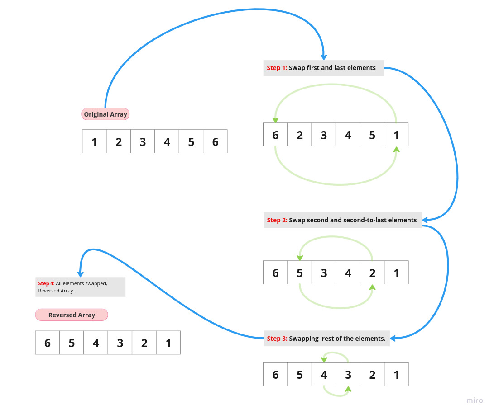

# Array Reverse

 This coding challenge involves creating a "whiteboard only" solution
 to reverse an array, where is required to write a function named
 reverseArray that takes an array as input and returns a new array with
 its elements reversed.

## Whiteboard Process



## Approach & Efficiency

```
We can iterate through the input array from both ends and swap elements symmetrically.
Starting from the first and last elements, swapping them, then moving towards the
center while continuing to swap elements until we reach the middle of the array.
```

- **Big O Analysis**
  - Time Complexity: The time complexity of this approach is O(n), where n is the number of
    elements in the array. This is because you iterate through the array once, and each element
    is swapped exactly once.
  - Space Complexity: remains constant at O(1) since I'm using a constant amount of extra space for temporary variables used in the swapping process.

## Solution

   1. cd java-challenges.
   2. javac ArrayReverse.
   3. java ArrayReverse.
